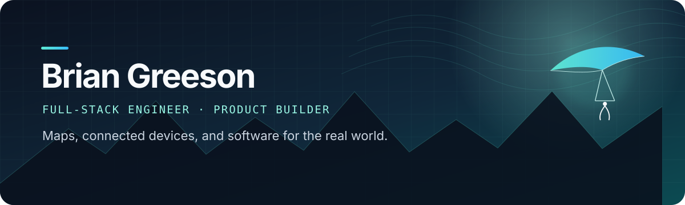

<div align="center">

[](https://glidehero.com)
[](https://github.com/brian-greeson?tab=repositories)

</div>

## I build where software meets the real world.

I am a full-stack engineer and product builder focused on geospatial systems, connected devices, interactive simulations, and the infrastructure that makes them dependable.

My favorite projects cross boundaries: GPS tracks become multiplayer maps, an IMU on a paddle becomes an iPhone training experience, and flight physics become something you can explore in a browser. I work from product concept through architecture, interface, testing, deployment, and the stubborn edge cases in between.

```text
PRODUCT + WEB + MOBILE + GEOSPATIAL + EMBEDDED
```

## Featured work

### 🪂 [GlideHero](https://github.com/brian-greeson/glide-hero-public) — exploration, mapped

**Creator · Product engineer · Full-stack developer**

GlideHero turns paraglider GPS tracks into persistent territory, achievements, flight replay, and friendly competition. I designed and built the product end to end—from its spatial game model and asynchronous flight-processing pipeline to its responsive maps, social systems, production infrastructure, and operations.

`TypeScript` · `Node.js` · `PostgreSQL/PostGIS` · `MapLibre` · `Valkey` · `Object storage`

[**View the engineering showcase →**](https://github.com/brian-greeson/glide-hero-public) &nbsp;·&nbsp; [**Try GlideHero →**](https://glidehero.com)

---

### 🏓 PickleMotion — one product, from sensor to screen

An end-to-end smart-paddle system that captures motion around paddle impacts and delivers it to a native training experience.

| [PickleFeed for iOS](https://github.com/brian-greeson/pickleapp-ios) | [PickleMotion firmware](https://github.com/brian-greeson/picklemotion-firmware) |
| --- | --- |
| A SwiftUI social and scoring app with Apple Watch support, Bluetooth paddle workflows, local swing storage, firmware updates, and on-device experiences. | nRF52840 firmware sampling an IMU at 200 Hz, detecting impacts, persisting validated swing records to flash, and transferring them reliably over BLE. |
| `SwiftUI` · `SwiftData` · `WatchConnectivity` · `CoreBluetooth` | `C++` · `PlatformIO` · `BLE` · `IMU` · `QSPI flash` |

## More things I have built

| Project | What makes it interesting |
| --- | --- |
| [**Towforce**](https://github.com/brian-greeson/towForce) | A real-time 2D paraglider tow simulator with deterministic physics, coupled winch/line/aerodynamic behavior, live telemetry, and 47 tunable parameters. |
| [**IGC Parser**](https://github.com/brian-greeson/igc-parser) | A TypeScript package that converts standard glider flight logs into structured metadata, track points, and GeoJSON. Published on [JSR](https://jsr.io/@brian-greeson/igc-parser). |
| [**Venturi**](https://github.com/brian-greeson/venturi-template) | A deliberately small, production-minded starter for server-rendered TypeScript apps using Express, Vento, SQLite, Drizzle, Docker, and Kamal. |
| [**SoloTow**](https://github.com/brian-greeson/soloTow) | An open DIY electric winch project that combines mechanical design, power electronics, embedded control, documentation, and real-world field testing. |
| [**blist**](https://github.com/brian-greeson/blist) | A lightweight native Swift tool for finding and interacting with nearby Bluetooth Low Energy devices during firmware development. |

## The toolbox

| Product & interface | Systems & data | Devices & native |
| --- | --- | --- |
| TypeScript, JavaScript, HTML/CSS, Vento, responsive UI | Node.js, Express, PostgreSQL, PostGIS, Drizzle, Valkey, object storage | Swift, SwiftUI, watchOS, C/C++, PlatformIO, BLE, IMUs |

I care about clear product contracts, boringly reliable data, responsive interfaces, and tests that cover the boundary where things actually break. I especially enjoy projects that require learning a new domain deeply enough to turn its messy reality into a useful tool.

<div align="center">

### Let’s build something that moves.

[](https://github.com/brian-greeson)

</div>
